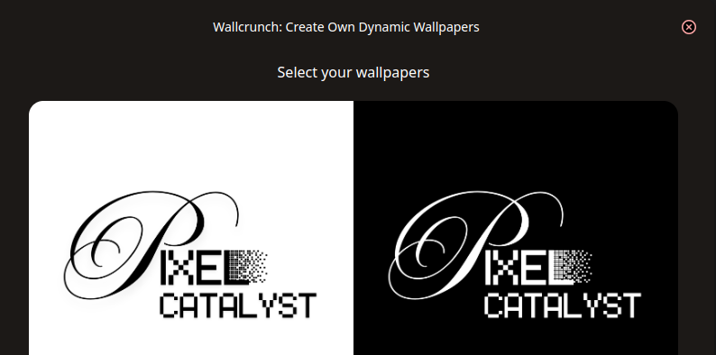

# 🌟 Wallcrunch: Dynamic Walls

<div align="center">
  
  [](https://pixel-catalyst.github.io/wallcrunch)
  [](https://github.com/pixel-catalyst/wallcrunch)
  [](./assets/out/wallcrunch.deb)
  [](./LICENSE)
  
  **Create your Custom Dynamic Wallpapers for GNOME in just 2 steps!**
  
  *Ever wondered how GNOME Desktop Environments provide their own set of dynamic wallpapers? Let's build our own in 3 clicks.*
  
</div>



## 🚀 What is Wallcrunch?

Wallcrunch is a powerful ElectronJS application that allows you to create custom dynamic wallpapers for GNOME desktop environments with incredible ease. Transform your desktop experience by creating wallpapers that change throughout the day based on time or other conditions.

### ✨ Key Features

- 🎨 **Custom Dynamic Wallpapers**: Create wallpapers that change based on time of day
- 🖱️ **Simple 2-Step Process**: User-friendly interface for quick wallpaper creation
- 🐧 **GNOME Integration**: Seamless integration with GNOME desktop environment
- ⚡ **Built with Electron**: Cross-platform compatibility and modern UI
- 🎯 **XML Generation**: Automatically generates GNOME-compatible XML files
- 🔧 **Customizable Transitions**: Control how and when your wallpapers change

## 📁 Project Structure

```
wallcrunch/
├── 📄 Web Frontend (Landing Page)
│   ├── index.html              # Main landing page
│   ├── about.html              # About page
│   ├── contact.html            # Contact page
│   ├── pricing.html            # Pricing information
│   ├── signin.html & signup.html # Authentication pages
│   └── blog-*.html             # Blog pages
│
├── 🖥️ Electron Application
│   ├── electron/
│   │   ├── src/
│   │   │   ├── index.ts        # Main electron process
│   │   │   ├── app.tsx         # React application
│   │   │   ├── preload.ts      # Preload scripts
│   │   │   ├── renderer.ts     # Renderer process
│   │   │   ├── wallpaperLogic.ts # Core wallpaper logic
│   │   │   └── backend/        # Backend utilities
│   │   ├── webpack.*.js        # Webpack configuration
│   │   └── package.json        # Electron dependencies
│
├── 🎨 Assets & Styles
│   ├── assets/
│   │   ├── css/                # Stylesheets
│   │   ├── js/                 # JavaScript files
│   │   ├── images/             # Images and icons
│   │   ├── icons/              # Application icons
│   │   └── out/                # Build outputs
│   └── src/
│       ├── input.css           # Tailwind input styles
│       └── css/tailwind.css    # Generated Tailwind CSS
│
├── ⚙️ Configuration
│   ├── package.json            # Main project dependencies
│   ├── tailwind.config.js      # Tailwind configuration
│   ├── .prettierrc             # Code formatting
│   └── .gitignore              # Git ignore rules
│
└── 📚 Documentation
    ├── README.md               # This file
    └── LICENSE                 # MIT License
```

## 🛠️ Installation & Setup

### Prerequisites

- **Node.js** (v16 or higher)
- **npm** or **yarn**
- **GNOME Desktop Environment** (for full functionality)
- **Linux** (Ubuntu/Debian recommended)

### Quick Start

#### Option 1: Download Pre-built Package (Recommended)

1. **Download the latest release**:
   ```bash
   wget https://pixel-catalyst.github.io/wallcrunch/assets/out/wallcrunch.deb
   ```

2. **Install the package**:
   ```bash
   sudo dpkg -i wallcrunch.deb
   sudo apt-get install -f  # Fix any dependency issues
   ```

3. **Launch Wallcrunch**:
   ```bash
   wallcrunch
   # OR find it in your applications menu
   ```

#### Option 2: Build from Source

1. **Clone the repository**:
   ```bash
   git clone https://github.com/pixel-catalyst/wallcrunch.git
   cd wallcrunch
   ```

2. **Install main dependencies**:
   ```bash
   npm install
   ```

3. **Setup Electron application**:
   ```bash
   cd electron
   npm install
   ```

4. **Build Tailwind CSS**:
   ```bash
   cd ..
   npm run dev
   ```

5. **Start the Electron app**:
   ```bash
   cd electron
   npm start
   ```

### Development Setup

For developers who want to contribute or modify the application:

```bash
# Clone and setup
git clone https://github.com/pixel-catalyst/wallcrunch.git
cd wallcrunch

# Install dependencies
npm install
cd electron && npm install && cd ..

# Start development servers
# Terminal 1: Tailwind CSS watch mode
npm run dev

# Terminal 2: Electron development
cd electron
npm start
```

## 🎯 How to Use Wallcrunch

### Step 1: Launch the Application
- Open Wallcrunch from your applications menu or run `wallcrunch` in terminal

### Step 2: Create Your Dynamic Wallpaper
1. **Select Images**: Choose multiple images for different times of day
2. **Set Transitions**: Configure when each image should be active
3. **Generate XML**: Let Wallcrunch create the GNOME-compatible XML file
4. **Apply Wallpaper**: Set your new dynamic wallpaper as desktop background


## 🔧 Technology Stack

- **Frontend**: 
  - HTML5, CSS3, JavaScript
  - Tailwind CSS for styling
  - React for Electron UI

- **Backend**: 
  - Electron.js for desktop application
  - Node.js for backend logic
  - TypeScript for type safety

- **Build Tools**:
  - Webpack for bundling
  - Electron Forge for packaging
  - Prettier for code formatting

- **Deployment**:
  - GitHub Pages for web hosting
  - Debian packaging for Linux distribution

## 🐛 Troubleshooting

### Common Issues and Solutions

#### 1. **Application won't start**

**Problem**: Wallcrunch fails to launch or crashes on startup

**Solutions**:
```bash
# Check if all dependencies are installed
sudo apt-get install -f

# Verify Node.js version
node --version  # Should be v16+

# Clear electron cache
rm -rf ~/.cache/wallcrunch

# Run from terminal to see error messages
wallcrunch --verbose
```

#### 2. **Wallpaper not applying to GNOME**

**Problem**: Generated wallpaper doesn't show up in GNOME settings

**Solutions**:
```bash
# Check GNOME version compatibility
gnome-shell --version

# Manually set wallpaper using gsettings
gsettings set org.gnome.desktop.background picture-uri 'file:///path/to/your/wallpaper.xml'

# Reset GNOME background settings
gsettings reset org.gnome.desktop.background picture-uri
gsettings reset org.gnome.desktop.background picture-options
```

#### 3. **Build/Development Issues**

**Problem**: Errors during npm install or build process

**Solutions**:
```bash
# Clear npm cache
npm cache clean --force

# Delete node_modules and reinstall
rm -rf node_modules package-lock.json
npm install

# For Electron specific issues
cd electron
rm -rf node_modules
npm install

# Rebuild native modules
npm rebuild
```

#### 4. **Tailwind CSS not updating**

**Problem**: Style changes not reflecting in the application

**Solutions**:
```bash
# Restart Tailwind watch mode
npm run dev

# Force regenerate CSS
rm src/css/tailwind.css
npm run dev

# Check Tailwind config
cat tailwind.config.js
```

#### 5. **Permission Issues**

**Problem**: Cannot write files or access directories

**Solutions**:
```bash
# Fix ownership of wallcrunch directory
sudo chown -R $USER:$USER ~/.local/share/wallcrunch

# Create necessary directories
mkdir -p ~/.local/share/wallcrunch
mkdir -p ~/.config/wallcrunch

# Set proper permissions
chmod 755 ~/.local/share/wallcrunch
chmod 644 ~/.config/wallcrunch/*
```

### Debug Mode

To run Wallcrunch in debug mode for detailed logging:

```bash
# Enable debug logging
DEBUG=wallcrunch:* wallcrunch

# Or set environment variable
export DEBUG=wallcrunch:*
wallcrunch
```

### Getting Help

If you're still experiencing issues:

1. **Check the logs**:
   ```bash
   # Application logs location
   ~/.config/wallcrunch/logs/
   
   # View recent logs
   tail -f ~/.config/wallcrunch/logs/main.log
   ```

2. **System Requirements**:
   - Ensure you're running a supported GNOME version (3.36+)
   - Verify system has sufficient resources (minimum 2GB RAM)
   - Check disk space for wallpaper storage

3. **Report Issues**:
   - Open an issue on [GitHub](https://github.com/pixel-catalyst/wallcrunch/issues)
   - Include system information, error logs, and steps to reproduce

## 🤝 Contributing

We welcome contributions! Here's how you can help:

1. **Fork the repository**
2. **Create a feature branch**: `git checkout -b feature/amazing-feature`
3. **Make your changes** and test thoroughly
4. **Commit your changes**: `git commit -m 'Add amazing feature'`
5. **Push to the branch**: `git push origin feature/amazing-feature`
6. **Open a Pull Request**

### Development Guidelines

- Follow the existing code style (Prettier configuration included)
- Write meaningful commit messages
- Test your changes on GNOME desktop environment
- Update documentation if needed

## 📋 Roadmap

- [ ] Support for more desktop environments (KDE, XFCE)
- [ ] Cloud sync for wallpaper collections
- [ ] Advanced transition effects
- [ ] Mobile companion app
- [ ] Community wallpaper sharing
- [ ] Automated wallpaper generation from themes

## 📄 License

This project is licensed under the MIT License - see the [LICENSE](LICENSE) file for details.

## 👨‍💻 Author

**Ashwin Sharma**
- Email: ashwin.aksharma.p@gmail.com
- GitHub: [@pixel-catalyst](https://github.com/pixel-catalyst)
- Website: [snippetsofpassion.vercel.app](https://snippetsofpassion.vercel.app)

## 🌟 Acknowledgments

- Thanks to the GNOME community for inspiration
- TailGrids for the beautiful landing page template
- Electron.js team for the amazing framework
- All contributors and users who make this project better

---

<div align="center">
  
  **Made with ❤️ for the Linux community**
  
  [](https://pixel-catalyst.github.io/wallcrunch)
  
</div>

